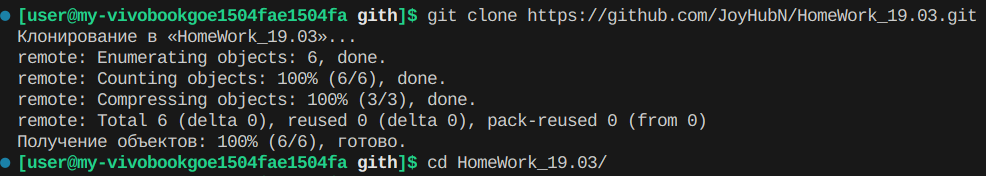
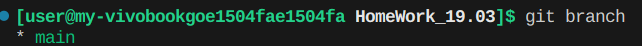
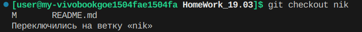

### Данный репозиторий был создан с целью выполнения домашнего задания
<hr>

1. Дополните этот файл инструкциями только по работе с удаленными репозиториями<br>
2. Отправьте pull request<br>

Начните ввод ниже...


# Клонирование репозитория
```bash
git clone https://github.com/nameUser/nameRep.git
```
<br>
<ul>
    <li>nameUser — имя пользователя</li>
    <li>nameRep — название репозитория</li>
</ul>


# Смотрим какие есть ветки
```bash
git lbranch
```


# Создадим свою ветку
```bash
git branch name_branch
```


# Переключимся на созданную ветку
```bash
git checkout name_branch
```
